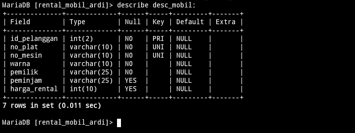
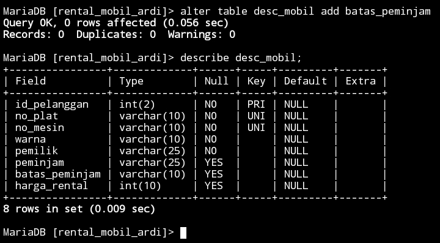
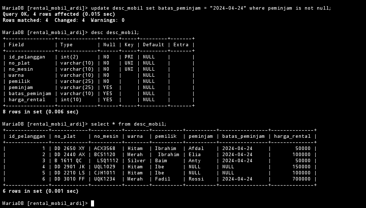
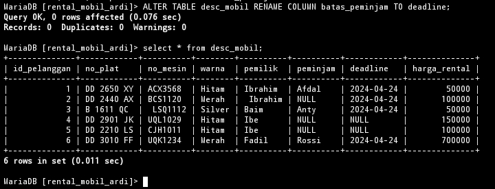
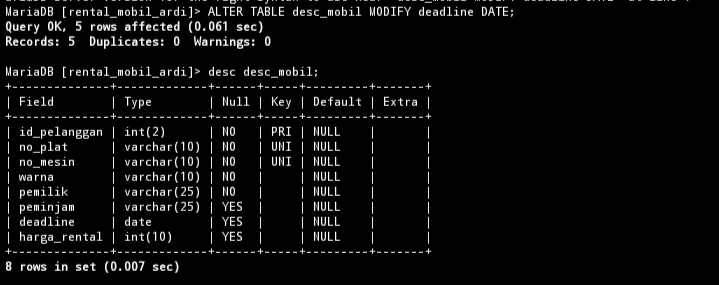
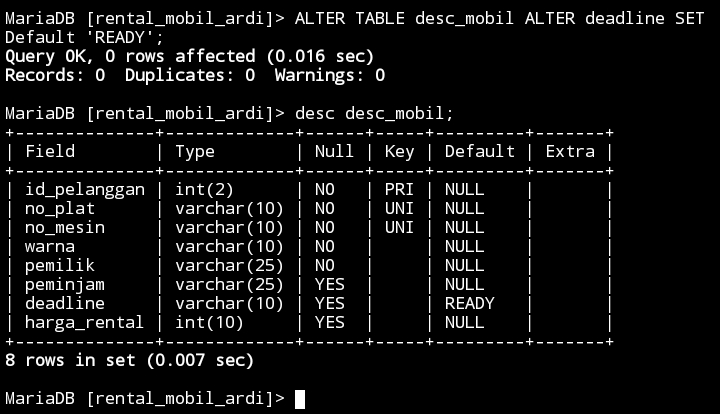
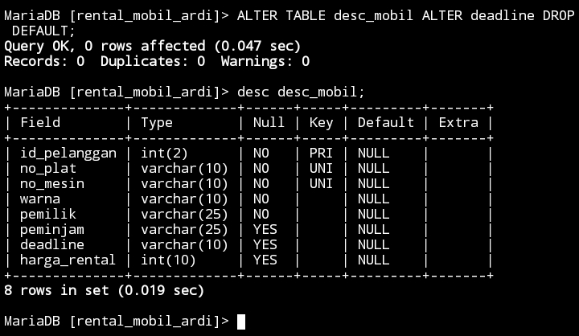
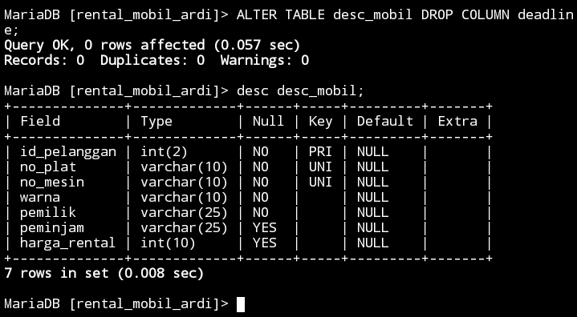
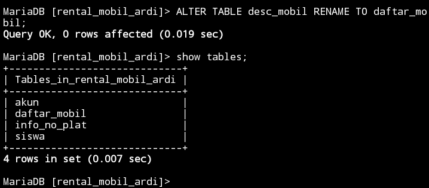

# Menambahkan colum
## Before
Gambar table sebelum menggunakan query alter


## Struktur 

```mysql
ALTER TABLE nama_tabel ADD nama_kolom varchar(10) AFTER nama_kolom;
```

## Contoh

```mysql
alter table desc_mobil add batas_peminjam varchar(10) after peminjam;
```

## Hasil 



## Analisis 

1. `ALTER TABLE`: Ini menunjukkan bahwa kita sedang memodifikasi struktur dari tabel yang sudah ada.
2. `mobil`: Ini adalah nama tabel yang akan kita ubah.
3. `ADD batas_peminjam varchar(10)`: Ini berarti kita akan menambahkan kolom baru bernama `batas_peminjam` ke tabel `mobil`, dan kolom tersebut akan memiliki tipe karakter variabel dengan panjang maksimum 10 karakter.
4. `AFTER peminjam`: Ini menunjukkan bahwa kolom baru `batas_peminjam` akan ditambahkan setelah kolom yang sudah ada yaitu `peminjam` di dalam tabel.

## Kesimpulan 

Pernyataan SQL tersebut menambahkan kolom baru dengan nama `batas_peminjam` ke tabel `mobil`, dengan tipe data karakter variabel dan panjang maksimum 10 karakter, yang akan ditempatkan setelah kolom `peminjam` yang sudah ada di dalam tabel.

# Tambahan
## Contoh qury

```mysql
update desc_mobil set batas_peminjam="2024-04-24" where peminjam is not null;
```

## Hasil



# Mengubah nama kolom
## Struktur 

```mysql
ALTER TABLE nama_tabel RENAME COLUMN nama_kolom TO nama_kolom_yang_baru;
```

## Contoh

```mysql
ALTER TABLE desc_mobil RENAME COLUMN batas_peminjam TO deadline;
```

## Hasil



## Analisis 

1. `ALTER TABLE`: Ini menunjukkan bahwa kita sedang memodifikasi struktur dari sebuah tabel.
2. `mobil`: Ini adalah nama tabel yang akan kita ubah.
3. `RENAME COLUMN batas_peminjam TO deadline`: Ini berarti kita akan mengubah nama kolom yang sudah ada dari `batas_peminjam` menjadi `deadline` di dalam tabel `mobil`.

## Kesimpulan

Pernyataan SQL tersebut mengubah nama kolom yang sudah ada dari `batas_peminjam` menjadi `deadline` di dalam tabel `mobil`.

# Mengubah tipe data kolom
## Struktur 

```mysql
ALTER TABLE nama_tabel MODIFY nama_kolom DATE;
```

## Contoh 

```mysql
ALTER TABLE desc_mobil MODIFY deadline DATE;
```

## Hasil



## Analisis 

1. `ALTER TABLE`: Ini adalah perintah SQL yang digunakan untuk mengubah struktur tabel.
2. `mobil`: Ini adalah nama tabel yang ingin Anda ubah strukturnya.
3. `MODIFY deadline DATE:` Ini adalah bagian yang melakukan perubahan. Perintah ini mengubah kolom "`deadline`" dalam tabel "`mobil`" menjadi memiliki tipe data `DATE`. Ini berarti kolom "`deadline`" sebelumnya mungkin memiliki tipe data yang berbeda, dan Anda sedang mengubahnya menjadi tipe data `DATE`.

## Kesimpulan 

`ALTER TABLE mobil MODIFY deadline DATE;` mengubah tipe data kolom "`deadline`" dalam tabel "`mobil`" menjadi `DATE`. Ini memastikan bahwa kolom tersebut hanya dapat menyimpan nilai-nilai tanggal yang valid. Pastikan untuk memeriksa kompatibilitas data yang ada dan lakukan pencadangan data sebelum menjalankan perintah tersebut.

# Menambahkan constraint
## Struktur 

```mysql
ALTER TABLE nama_tabel ALTER nama_kolom SET DEFAULT 'READY';
```

## Contoh

```mysql
ALTER TABLE desc_mobil ALTER deadline SET DEFAULT 'READY';
```

## Hasil



## Analisis 

1. `ALTER TABLE`: Ini adalah perintah SQL yang digunakan untuk mengubah struktur tabel.
2. `mobil`: Ini adalah nama tabel yang ingin Anda ubah strukturnya.
3. `ALTER deadline SET DEFAULT READY`: Ini adalah bagian yang melakukan perubahan. Perintah ini mengatur nilai default untuk kolom "`deadline`" dalam tabel "`mobil`" menjadi `READY`. Ini berarti bahwa jika baris baru ditambahkan ke tabel tanpa nilai yang ditentukan untuk kolom "`deadline`", maka nilainya akan secara otomatis diatur menjadi '`READY`'.

## Kesimpulan 

Perintah `ALTER TABLE mobil ALTER deadline SET DEFAULT 'READY';` mengatur nilai default untuk kolom "`deadline`" dalam tabel "`mobil`" menjadi '`READY`'. Ini akan membuat '`READY`' menjadi nilai default untuk kolom "`deadline`" jika tidak ada nilai yang ditentukan saat penambahan baris baru. Pastikan nilai default tersebut sesuai dengan kebutuhan aplikasi Anda sebelum menjalankan perintah ini.

# Menghapus constraint
## Struktur 

```mysql
ALTER TABLE nama_tabel ALTER nama_kolom DROP DEFAULT;
```

## Contoh

```mysql
ALTER TABLE desc_mobil ALTER deadline DROP DEFAULT;
```

## Hasil



## Analisis 

1. `ALTER TABLE`: Ini adalah perintah SQL yang digunakan untuk mengubah struktur tabel.
2. `mobil`: Ini adalah nama tabel yang ingin Anda ubah strukturnya.
3. `ALTER deadline DROP DEFAULT`: Ini adalah bagian yang melakukan perubahan. Perintah ini menghapus nilai default dari kolom "`deadline`" dalam tabel "`mobil`". Ini berarti bahwa setelah perintah ini dijalankan, jika baris baru ditambahkan ke tabel tanpa nilai yang ditentukan untuk kolom "`deadline`", kolom tersebut tidak akan memiliki nilai default.

## Kesimpulan 

Perintah `ALTER TABLE mobil ALTER deadline DROP DEFAULT;` menghapus nilai default dari kolom "`deadline`" dalam tabel "`mobil`". Setelah perintah ini dijalankan, kolom tersebut tidak akan memiliki nilai `default`. Pastikan hal ini sesuai dengan kebutuhan aplikasi Anda sebelum menjalankan perintah tersebut.

## Referensi

https://www.geeksforgeeks.org/sql-drop-constraint/

# Menghapus kolom
## Struktur 

```mysql
ALTER TABLE nama_tabel DROP COLUMN nama_kolom;
```

## Contoh

```mysql
ALTER TABLE desc_mobil DROP COLUMN deadline;
```

## Hasil



## Analisis 

1. `ALTER TABLE`: Ini adalah perintah SQL yang digunakan untuk mengubah struktur tabel.
2. `mobil`: Ini adalah nama tabel yang ingin Anda ubah strukturnya.
3. `DROP COLUMN deadline`: Ini adalah bagian yang melakukan perubahan. Perintah ini menghapus kolom "`deadline`" dari tabel "`mobil`". Ini berarti bahwa setelah perintah ini dijalankan, kolom "`deadline`" beserta semua data yang ada di dalamnya akan dihapus dari tabel "`mobil`".

## Kesimpulan 

Perintah `ALTER TABLE mobil DROP COLUMN deadline;` menghapus kolom "`deadline`" dari tabel "`mobil`". Ini akan menghapus semua data yang terkait dengan kolom tersebut. Pastikan untuk membuat pencadangan data sebelum menjalankan perintah ini dan pastikan bahwa penghapusan kolom tersebut sesuai dengan kebutuhan aplikasi Anda.

# Mengganti nama tabel
## Struktur 

```mysql
ALTER TABLE nama_tabel RENAME TO nama_kolom;
```

## Contoh 

```mysql
ALTER TABLE desc_mobil RENAME TO daftar_mobil;
```

## Hasil



## Analisis 

1. `ALTER TABLE`: Ini adalah pernyataan SQL yang digunakan untuk mengubah tabel yang ada.
2. `desc_mobil`: Ini adalah nama tabel saat ini yang ingin Anda ganti namanya.
3. `RENAME TO`: Ini menetapkan bahwa tindakan yang harus diambil adalah mengganti nama tabel.
4. `daftar_mobil`: Ini adalah nama baru untuk tabel tersebut.

## Kesimpulan 

Mengganti nama tabel dari `desc_mobil` menjadi `daftar_mobil` menggunakan perintah SQL `ALTER TABLE desc_mobil RENAME TO daftar_mobil;` adalah operasi sederhana yang dimaksudkan untuk memperbarui nama tabel agar jelas atau selaras dengan konvensi penamaan.

# Referensi pembahasan alter

https://www.techonthenet.com/mysql/tables/alter_table.php
