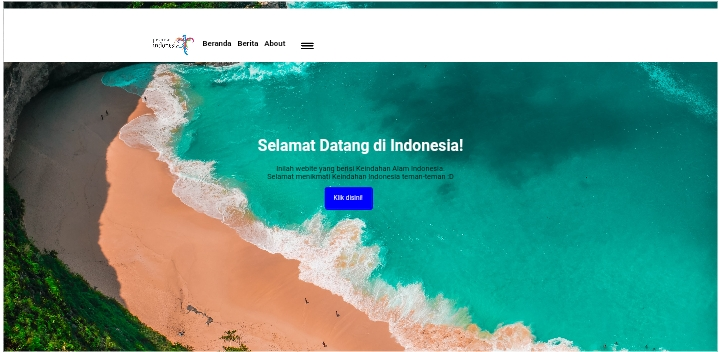
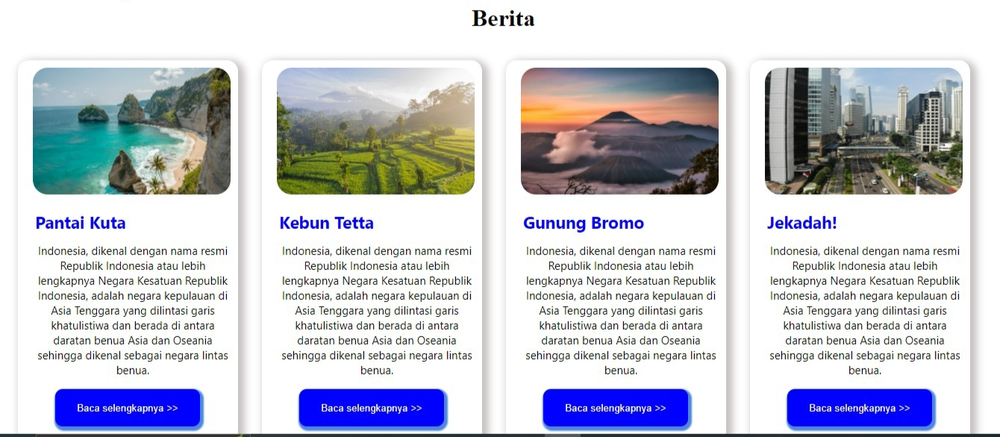
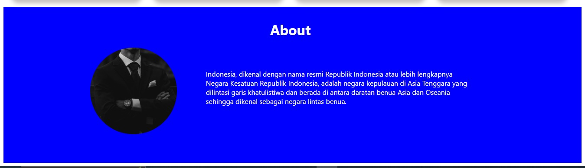

# Program Html 

```html
<!DOCTYPE html>

<html>

<head>

    <link rel="stylesheet" href="pesona.css">

    <title>Pesona Indonesia</title>

</head>

<body>

   <div class="container">

        <nav class="navbar"></nav>

        <div class="kotak">

                

                    <div class="tulisan">

                        <h4 class="teksnavbar">&nbsp;&nbsp;&nbsp;&nbsp;Beranda&nbsp;&nbsp;&nbsp;Berita&nbsp;&nbsp;&nbsp;About&nbsp;&nbsp;&nbsp;&nbsp;</h4>

                        

                    </div>

        </div>


        <div class="box1">

            <h1 class="teks2">Selamat Datang di Indonesia!</h1>

             <p class="teks3">Inilah webite yang berisi Keindahan Alam Indonesia.<br>Selamat menikmati Keindahan Indonesia teman-teman :D</p>

             <button class="tombol2">Klik disini!</button>

        </div>


        <div class="box2">

            <h1 class="judul" align="center">Berita</h1>

              <div class="berita">

                    

                    <h2 class="tk">Pantai Kuta</h2> <br>

                    <p class="teks33">Indonesia, dikenal dengan nama resmi Republik Indonesia 

                        atau lebih lengkapnya Negara Kesatuan Republik Indonesia,

                        adalah negara kepulauan di Asia Tenggara yang dilintasi garis khatulistiwa

                        dan berada di antara daratan benua Asia

                        dan Oseania sehingga dikenal sebagai negara lintas benua.</p>

                    <button class="tombol1">Baca selengkapnya >></button>

              </div>

              <div class="berita">

                    

                    <h2 class="tk">Kebun Tetta</h2> <br>

                    <p class="teks33">Indonesia, dikenal dengan nama resmi Republik Indonesia 

                        atau lebih lengkapnya Negara Kesatuan Republik Indonesia,

                        adalah negara kepulauan di Asia Tenggara yang dilintasi garis khatulistiwa

                        dan berada di antara daratan benua Asia

                        dan Oseania sehingga dikenal sebagai negara lintas benua.</p>

                    <button class="tombol1">Baca selengkapnya >></button>

              </div>


              <div class="berita">

                

                <h2 class="tk">Gunung Bromo</h2> <br>

                <p class="teks33">Indonesia, dikenal dengan nama resmi Republik Indonesia 

                    atau lebih lengkapnya Negara Kesatuan Republik Indonesia,

                    adalah negara kepulauan di Asia Tenggara yang dilintasi garis khatulistiwa

                    dan berada di antara daratan benua Asia

                    dan Oseania sehingga dikenal sebagai negara lintas benua.</p>

                <button class="tombol1">Baca selengkapnya >></button>

              </div>


              <div class="berita">

                

                <h2 class="tk">Jekadah!</h2> <br>

                <p class="teks33">Indonesia, dikenal dengan nama resmi Republik Indonesia 

                    atau lebih lengkapnya Negara Kesatuan Republik Indonesia,

                    adalah negara kepulauan di Asia Tenggara yang dilintasi garis khatulistiwa

                    dan berada di antara daratan benua Asia

                    dan Oseania sehingga dikenal sebagai negara lintas benua.</p>

                <button class="tombol1">Baca selengkapnya >></button>

              </div>

        </div>

        <div class="box3">

        <h1 class="about">About</h1>

        <div class="teks4">

                

                <p class="teks5">Indonesia, dikenal dengan nama resmi Republik Indonesia

                    atau lebih lengkapnya <br> Negara Kesatuan Republik Indonesia,

                    adalah negara kepulauan di Asia Tenggara yang <br> dilintasi garis khatulistiwa

                    dan berada di antara daratan benua Asia dan Oseania <br> sehingga dikenal sebagai negara lintas benua.</p>

            </div>

        </div>


   </div>

</body>

</html>
```

# Program Css 

```css
.container{

    width: auto;

    height: auto;
}
 .container >.kotak{

    width: 100%;

    height: 15%;

    position: fixed;

    background-color: white;

    margin-top: 1%;

    z-index: 1;

}

.navbar {

    background-color: #f8f2f2;

    overflow: hidden;

    position: fixed;

    width: 100%;

    height: 50px;

}

.navbar img {

    float: left;

    height: 50px;

    padding-left: 2opx;

    padding-bottom: 10px;

    margin-left: 60px;

}

.navbar ul {

    list-style: none;

}

.navbar li {

    display: inline;

    padding: 15px;

}

.navbar li a {

    color: black;

    text-decoration: none;

}

.box  >.tulisan{

    margin-left: 38%;

    font-size: 18px;

    padding-top: 40px;

   font-family: 'Segoe UI';

}

.logo{

    width: 100px;

    height: 50px;

    margin-left: 350px;

    float: left;

    margin-top: 60px;

}

.teksnavbar {

  margin-left: 15px;

  margin-top: 70px;

  

}

.samadengan{

  width: 30px;

  height: 15px;

  margin-left: 700px;

  margin-top: -100px;

  padding-bottom: 35px;

}

.box1{

    padding-bottom: 20%;

    padding-top: 10%;

    background-image: url(hiro.jpg);

    width: 100%;

    height: 18%;

    margin-bottom: 40px;

    background-size:cover ;

}

.teks3{

    text-align: center;

    font-size: 15px;

    font-family: 'Segoe UI';

    margin-top: 10px;

}

.teks33{

    text-align: center;

    font-size: 15px;

    font-family: 'Segoe UI';

    margin-top: 5px;

    margin-right: 7px;

}

.teks2{

    margin-top: 150px;

    text-align: center;

    font-family: 'Segoe UI';

}

.teks2{

  color: white;

  text-align: center;

  font-family: 'Segoe UI';

}

.tombol2 {

  color: white;

  background-color: blue;

  width: 110px;

  height: 50px;

  margin-left: 45%;

  border-radius: 5px;

  box-shadow: 2px 2px 2px 2px blue;

  border: none;

  position: flex 15px;

}

.tombol2:hover {

  background-color: burlywood;

  color: black;

  box-shadow: 2px 3px 2px 3px gray;

  transition: all 0.5s easein;

}

.berita {

  margin-top: 150px;

    width: 275px;

    height: 520px;

    border-radius: 15px;

    box-shadow: 5px 4px 10px 4px #c7c1c1;

    float: left;

    margin: 16px;

    font-size: 15px;

    padding: 10px 0px 20px 20px;

  }

.tk{

    color: blue;

    font-family: 'Segoe UI';

   margin-bottom: 1px;

   margin-left: 3px;

  }

.gambar{

   width: 265px;

   border-radius: 20px;

   height: 170px;

  }

.tombol1{

    border: none;

    background-color: blue;

    width: 194px;

    height: 50px;

    color:white;

    box-shadow: 2px 3px 2px 3px #4c86df;

    border-radius: 10px;

    margin-top: 1px;

    margin-left: 30px;

  }

.tombol1:hover {

    background-color: burlywood;

    color: black;

    box-shadow: 2px 3px 2px 3px gray;

    transition: all 0.3s easein;

  }

.box3{    

    margin-top: 100px;

    background-color: blue;

    height: 360px;

    width: 100%;

    display: flex;

    flex-direction: column;

  }

.teks4 {

    display: flex;

    flex-direction: row;

}

.gambar1{

    width: 200px;

    height: 200px;

    border-radius: 100px;

    margin-left: 15%;

    margin-top: 50px;

    filter: grayscale(100%);

    margin-top: 0px;

}

.about{

    color: white;

    text-align: center;

    font-family: 'Segoe UI';

    padding-top: 35px;

    margin-top: 5px;

    margin-left: 10px;

  }

.teks5{

    text-align: justify;

    margin-top: 50px;

    font-family: 'Segoe UI';

    color: white;

    margin-left: 5%;

    display: flex;

    flex-direction: column;
```

# Hasil








 